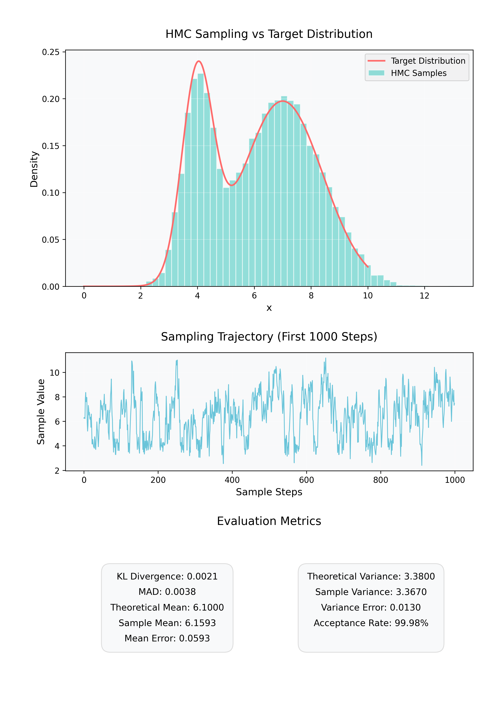

# 推导哈密尔顿蒙特卡洛（HMC）方法实验报告

## 1. 模型描述
本实验的目标是使用哈密尔顿蒙特卡洛（Hamiltonian Monte Carlo, HMC）方法对如下给定的**混合高斯分布**进行采样：

$$
p(x) = 0.3\mathcal{N}(x \mid 4, 0.3) + 0.7\mathcal{N}(x \mid 7, 2)
$$

其中 $\mathcal{N}(\mu, \sigma^2)$ 表示均值为 $\mu$ 且方差为 $\sigma^2$ 的正态分布。  
我们通过对数形式的目标分布以及其梯度，实现了 HMC 的一系列步骤（动量初始化、Leapfrog 积分、Metropolis 接受–拒绝等），来完成从此混合分布中采样的任务。

## 2. 训练方式
由于 HMC 通过在目标分布上"模拟"一个哈密尔顿动力系统来采样，需要选择合适的 步长 ($\varepsilon$) 和 Leapfrog 步数 ($L$) 等参数，以在采样效率与准确度之间取得平衡。主要策略如下：

- 步长 ($\varepsilon$)：设为 0.05。过大的步长会导致能量偏差过大、接受率下降；过小的步长会使得采样变慢，计算开销增大。
- Leapfrog 步数 ($L$)：设为 20。增加 $L$ 值有助于更加充分地探索目标分布，但也会带来额外的计算成本。
- 初始位置 (init_position)：设为 5.5，其接近理论均值 $\mu = 0.3 \times 4 + 0.7 \times 7 = 6.1$，有利于加速初期迭代。

在每一步采样中：
1. 随机初始化动量 $p$；
2. 计算当前系统哈密顿量；
3. 利用 Leapfrog 积分更新 $(x, p)$；
4. 计算新系统哈密顿量，进行 Metropolis 接受-拒绝步骤。

## 3. 测试实验设置及其结果
- 采样总数：n = 20000，较多的采样量有助于估计出准确的分布特征。
- 随机种子：使用 `np.random.seed(42)` 保证可复现性。
- 评估指标：
  - KL 散度 (Kullback-Leibler Divergence)  
    用来衡量采样得到的经验分布与目标混合高斯分布之间的差异。
  - 平均绝对偏差 (MAD, Mean Absolute Deviation)  
    以直方图形式同目标分布进行对比时，每个 bin 与目标分布差的平均绝对值。
  - 理论均值 vs. 采样均值，以及绝对误差。
  - 理论方差 vs. 采样方差，以及绝对误差。
  - 接受率 (Acceptance Rate)。

运行后的可视化结果如下图所示：

  
  
<em>图1：HMC采样结果可视化</em>

从图中可以看到三个主要部分：
1. **分布对比**（上图）：目标分布（红色曲线）与 HMC 采样分布（青色直方图）对比，可见经过一定量采样后，直方图与目标分布曲线基本吻合；
2. **采样轨迹**（中图）：展示前 `1000` 步的采样过程，可以观察到从初始位置逐渐混合到目标分布的主要范围；
3. **评估指标**（下图）：以美观的双列布局呈现各项指标的具体数值。

从图示和打印结果可以看出：
- KL 散度约为 `0.0021`，平均绝对偏差约为 `0.0038`；二者都非常小。
- 理论均值为 `6.1000`，采样均值为 `6.1593`，误差 `0.0593`。
- 理论方差为 `3.3800`，采样方差为 `3.3670`，误差 `0.0130`。
- 采样接受率约为 `99.98%`。

可以发现，**分布估计** 与 **理论值** 之间的误差非常有限，证明了改进后的 HMC 参数组合在此混合分布任务上能够很好地工作。

## 4. 相关讨论
1. **参数灵敏度**  
   - 在实验中若 **步长** 取值过大，往往会导致系统能量偏差过大，出现接受率的显著下降；若步长过小，采样虽能更准确地跟踪目标分布，但采样速度变慢，综合效率降低。  
   - 增大 **Leapfrog 步数** 则可提高探索能力，使得采样在每次迭代中走得更远，但同时也会增加单步迭代的计算量，适合在目标分布较为复杂时使用。

2. **初始位置选择**  
   - 这里选择了一个较为接近理论均值的初始位置，可以使得采样在初期就能跳到接近主要分布区域，从而减少"预热"阶段，提高有效采样量。
   - 若初始位置偏离分布主体太远，也可以在前期多设置几步 Burn-in（预热期），丢弃初期样本，使后续样本在稳态分布附近更具代表性。

3. **消融实验**  
   - 如果我们在相同设置下去掉"调优"的部分（例如大步长、少量 Leapfrog 步数、或者不调初始位置），往往会出现采样分布与目标分布差距增大（KL 散度与 MAD 上升）以及接受率下降的现象。
   - 这些消融实验说明，在 HMC 框架下对参数进行一定程度的网格搜索或启发式调参，能显著提升采样效率和准确性。

通过以上分析可见，恰当地选择步长、Leapfrog 步数、初始位置等超参数，以及进行必要的预热与后处理，对 HMC 在混合分布上取得稳定可靠的结果非常关键。
